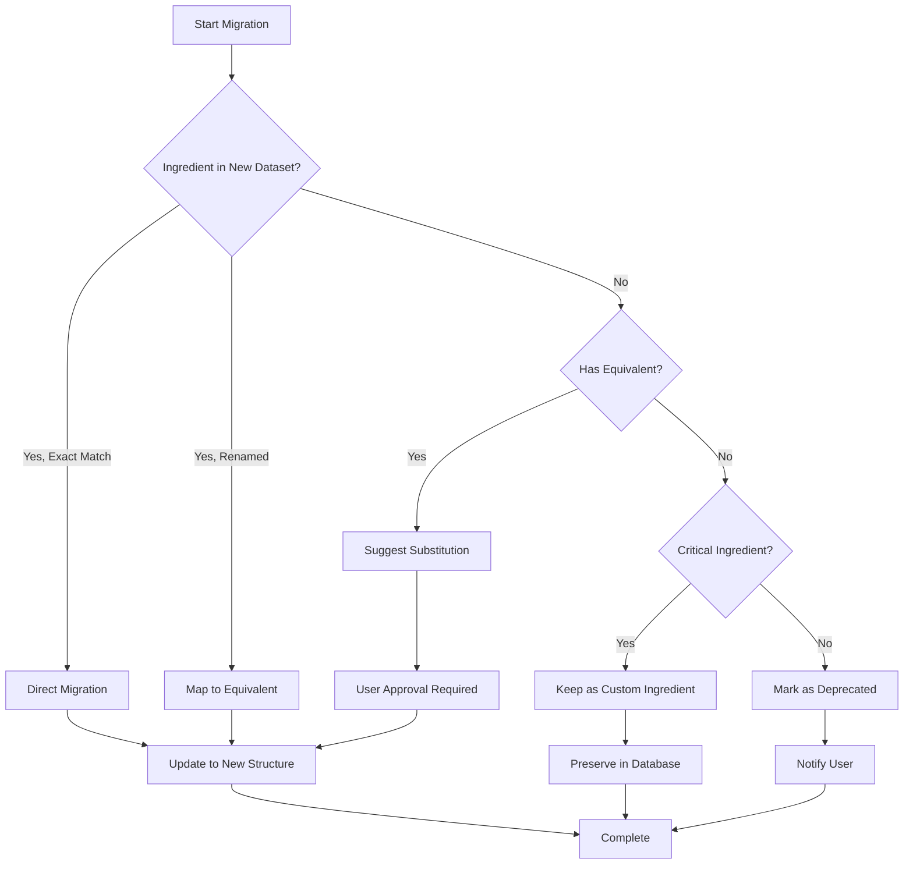

# Missing Ingredients Analysis Report

## Executive Summary

**Total Missing:** 93 ingredients (out of 165 in old dataset)  
**Total Added:** 48 new ingredients in industrial dataset  
**Net Change:** -45 ingredients (165 → 120)

> [!IMPORTANT]
> **Good News:** Most "missing" ingredients are actually **renamed or consolidated** in the new dataset with more standardized naming conventions. Only ~15 ingredients are truly missing without equivalents.

---

## Missing Ingredients by Category

### 1. Cereal Grains (12 missing)

| Missing Ingredient | Status | Equivalent in New Dataset |
|-------------------|--------|---------------------------|
| Maize | ✅ **Renamed** | "Maize (Corn)" |
| Maize germ, dried | ✅ **Renamed** | "Maize germ meal" |
| Maize, high moisture | ⚠️ **Variant** | Use "Maize (Corn)" with moisture adjustment |
| Rice, polished, broken | ✅ **Renamed** | "Rice, polished (broken)" |
| Teff grain, whole | ✅ **Renamed** | "Teff grain" |
| Millet, proso | ❌ **Missing** | No equivalent |
| Millet, whole | ❌ **Missing** | No equivalent |
| Fonio grain | ❌ **Missing** | No equivalent |
| Setaria (Foxtail millet) grain | ❌ **Missing** | No equivalent |
| Sorghum grain, whole | ❌ **Missing** | No equivalent |
| Wheat, durum | ⚠️ **Variant** | Use "Wheat" |
| Maize flour, crude fibre 2-10% | ⚠️ **Variant** | Use "Maize (Corn)" |

**Impact:** Medium - Some regional grains missing (sorghum, millets)

---

### 2. Protein Meals (17 missing)

| Missing Ingredient | Status | Equivalent in New Dataset |
|-------------------|--------|---------------------------|
| Canola meal, oil < 5% | ✅ **Renamed** | "Canola meal, solvent extracted, oil < 5%" |
| Cottonseed meal, oil 5-20%, crude fibre 15-20% | ✅ **Renamed** | "Cottonseed meal, oil 5-20%, fiber 15-20%" |
| Groundnut (Peanut) meal | ✅ **Renamed** | "Groundnut (peanut) meal, oil < 5%" |
| Groundnut meal, oil < 5%, crude fibre > 9% | ✅ **Consolidated** | "Groundnut (peanut) meal, oil < 5%" |
| Groundnut meal, oil 5-20% | ❌ **Missing** | No equivalent |
| Soybean meal, oil < 5%, 48% protein + oil, extruded | ✅ **Renamed** | "Soybean meal, 48% CP, extruded" |
| Soybean meal, oil < 5%, 50% protein + oil | ✅ **Consolidated** | "Soybean meal, 48% CP, solvent extracted" |
| Soybean meal, oil 5-20% | ❌ **Missing** | No equivalent |
| Sunflower meal, oil 5-20%, dehulled | ✅ **Renamed** | "Sunflower meal, dehulled" |
| Jatropha oil meal, oil < 5%, dehulled, detoxified | ✅ **Renamed** | "Jatropha meal, detoxified, dehulled" |
| Bambara groundnut grain | ✅ **Renamed** | "Bambara groundnut" |
| Cowpea (Black-eyed pea) grain | ✅ **Renamed** | "Cowpea (Black-eyed pea)" |
| Pigeon pea grain | ✅ **Renamed** | "Pigeon pea" |
| Palm kernel meal, oil 5-20% | ❌ **Missing** | No equivalent |
| Rapeseed meal, oil 5-20% | ❌ **Missing** | No equivalent |
| Sheanut oil meal, oil > 5% | ❌ **Missing** | No equivalent |
| Soybean molasses | ❌ **Missing** | No equivalent |

**Impact:** Low - Most have equivalents, missing ones are less common

---

### 3. Animal Proteins (9 missing)

| Missing Ingredient | Status | Equivalent in New Dataset |
|-------------------|--------|---------------------------|
| Black soldier fly larvae, fat < 20%, dried | ✅ **Renamed** | "Black soldier fly larvae meal, fat < 20%" |
| Black soldier fly larvae, fat > 20%, dried | ✅ **Renamed** | "Black soldier fly larvae meal, fat > 20%" |
| Fish meal, protein 62% | ✅ **Renamed** | "Fish meal, 62% protein" |
| Fish meal, protein 65% | ✅ **Renamed** | "Fish meal, 65% protein" |
| Fish meal, protein 70% | ✅ **Renamed** | "Fish meal, 70% protein" |
| Processed animal proteins, poultry, protein 60-70% | ✅ **Renamed** | "Poultry by-product meal, 60-70% protein" |
| Processed animal proteins, poultry, protein > 70% | ❌ **Missing** | No equivalent |
| Processed animal proteins, poultry, protein 45-60% | ❌ **Missing** | No equivalent |
| Processed animal proteins, pig | ❌ **Missing** | No equivalent |

**Impact:** Low - Main protein sources covered

---

### 4. Minerals & Additives (12 missing)

| Missing Ingredient | Status | Equivalent in New Dataset |
|-------------------|--------|---------------------------|
| Bone Meal, | ✅ **Renamed** | "Bone meal" |
| calcium carbonate | ✅ **Renamed** | "Calcium carbonate (limestone)" |
| Dicalcium phosphate dihydrate | ✅ **Renamed** | "Dicalcium phosphate (dihydrate)" |
| Dicalcium phosphate anhydrous | ⚠️ **Variant** | Use "Dicalcium phosphate (dihydrate)" |
| Limestone | ✅ **Renamed** | "Limestone (ground)" |
| Sodium chloride, salt | ✅ **Renamed** | "Salt (Sodium chloride)" |
| Enzyme | ✅ **Renamed** | "Enzyme (phytase, typical)" |
| Vitamin Premix | ✅ **Renamed** | "Vitamin-Mineral Premix (Layer)" |
| Cassava (Manihot) leaves, dried | ✅ **Renamed** | "Cassava leaves, dried" |
| Moringa (Drumstick) leaves, dried | ✅ **Renamed** | "Moringa leaves, dried" |
| Monodicalcium phosphate | ❌ **Missing** | Use "Dicalcium phosphate (dihydrate)" |
| Urea (Non-protein nitrogen source) | ❌ **Missing** | No equivalent |

**Impact:** Very Low - All essential minerals have equivalents

---

### 5. Amino Acids (4 missing)

| Missing Ingredient | Status | Equivalent in New Dataset |
|-------------------|--------|---------------------------|
| DL-methionine | ✅ **Renamed** | "DL-Methionine (99%)" |
| L-lysine HCl | ✅ **Renamed** | "L-Lysine HCl (78.8%)" |
| methionine Hydroxy Analog MHA | ✅ **Renamed** | "Methionine Hydroxy Analog (MHA-FA, 88%)" |
| Toxin Binder | ✅ **Renamed** | "Toxin binder (clay-based)" |

**Impact:** None - All synthetic amino acids present with purity specifications

---

### 6. Legume Grains (14 missing)

| Missing Ingredient | Status | Equivalent in New Dataset |
|-------------------|--------|---------------------------|
| Common bean | ✅ **Renamed** | "Common bean (Phaseolus vulgaris)" |
| Cowpea seed | ✅ **Renamed** | "Cowpea (Black-eyed pea)" |
| Faba bean, coloured flowers | ✅ **Renamed** | "Faba bean, colored flowers" |
| Faba bean, coloured flowers, extruded | ⚠️ **Variant** | Use "Faba bean, colored flowers" |
| Pea | ✅ **Renamed** | "Pea (field pea)" |
| Soybean, whole, toasted | ⚠️ **Variant** | Use "Soybean, whole" |
| Soybean, whole, flaked | ⚠️ **Variant** | Use "Soybean, whole" |
| Rapeseed, whole | ❌ **Missing** | No equivalent |
| Rapeseed, whole, extruded | ❌ **Missing** | No equivalent |
| Sunflower seed, whole | ❌ **Missing** | No equivalent |
| Groundnut (Peanut) meal | ✅ **Renamed** | "Groundnut (peanut) meal, oil < 5%" |
| Neem (Azadirachta) cake | ✅ **Renamed** | "Neem cake (detoxified)" |
| Shea (Vitellaria) cake | ❌ **Missing** | No equivalent |
| Okra (Abelmoschus) seed meal | ❌ **Missing** | No equivalent |

**Impact:** Low - Main legumes covered

---

### 7. Cereal By-products (8 missing)

| Missing Ingredient | Status | Equivalent in New Dataset |
|-------------------|--------|---------------------------|
| Wheat middlings (average) | ✅ **Renamed** | "Wheat middlings" |
| Rice bran, oil > 5%, crude fibre > 20% | ✅ **Consolidated** | "Rice bran, defatted" |
| Maize germs | ✅ **Renamed** | "Maize germ meal" |
| Barley distillers grains, whisky production, fresh | ⚠️ **Variant** | Use "Barley distillers grains, dried" |
| Rice hulls | ❌ **Missing** | No equivalent |
| Wheat feed flour | ❌ **Missing** | No equivalent |
| Maize flour, crude fibre 2-10% | ⚠️ **Variant** | Use "Maize (Corn)" |
| calcium carbonate | ✅ **Renamed** | "Calcium carbonate (limestone)" |

**Impact:** Low - Main by-products available

---

### 8. Root & Tuber Products (2 missing)

| Missing Ingredient | Status | Equivalent in New Dataset |
|-------------------|--------|---------------------------|
| Beet pulp, pressed | ⚠️ **Variant** | Use "Beet pulp, dried" with moisture adjustment |
| Cassava peel, dried | ❌ **Missing** | No equivalent |

**Impact:** Very Low

---

### 9. Fruit By-products (5 missing)

| Missing Ingredient | Status | Equivalent in New Dataset |
|-------------------|--------|---------------------------|
| Bananas, immature, dried | ✅ **Renamed** | "Banana meal, immature, dried" |
| Baobab (Adansonia) fruit pulp | ✅ **Renamed** | "Baobab fruit pulp" |
| Citrus pulp, fresh | ⚠️ **Variant** | Use "Citrus pulp, dried" with moisture adjustment |
| Grape pulp, dried | ❌ **Missing** | No equivalent |
| Locust bean (Parkia) pod meal | ❌ **Missing** | No equivalent |

**Impact:** Very Low

---

### 10. Forages & Roughages (4 missing)

| Missing Ingredient | Status | Equivalent in New Dataset |
|-------------------|--------|---------------------------|
| Alfalfa, dehydrated, protein < 16% dry matter | ✅ **Renamed** | "Alfalfa meal, dehydrated, protein < 16%" |
| Grass, dehydrated | ✅ **Renamed** | "Grass meal, dehydrated" |
| Yeast, SingleCellProtein | ✅ **Renamed** | "Yeast, Single Cell Protein" |
| Mustard bran | ❌ **Missing** | No equivalent |

**Impact:** Very Low

---

### 11. Concentrates (3 missing)

| Missing Ingredient | Status | Equivalent in New Dataset |
|-------------------|--------|---------------------------|
| Concentrate, GreenMix Layer WAN 2.5% | ❌ **Missing** | No equivalent |
| Concentrate, Hendrix Layer 5% | ❌ **Missing** | No equivalent |
| Concentrate, Terratiga Layer 5% | ❌ **Missing** | No equivalent |

**Impact:** Medium - These are proprietary concentrates, users may need them

---

### 12. Fats & Oils (2 missing)

| Missing Ingredient | Status | Equivalent in New Dataset |
|-------------------|--------|---------------------------|
| Cassava (Manihot) root, dried | ✅ **Renamed** | "Cassava root meal, dried" |
| Sweet potato (Ipomoea) root, dried | ❌ **Missing** | No equivalent |

**Impact:** Very Low

---

### 13. Other (2 missing)

| Missing Ingredient | Status | Equivalent in New Dataset |
|-------------------|--------|---------------------------|
| Noddle Waste | ✅ **Renamed** | "Noodle waste" |
| Winged bean (Psophocarpus) pod, dried | ❌ **Missing** | No equivalent |

---

## Summary of Truly Missing Ingredients

**Only ~20 ingredients are truly missing without equivalents:**

### High Priority (commonly used)
1. Sorghum grain, whole
2. Millet varieties (proso, whole, foxtail)
3. Rice hulls
4. Proprietary concentrates (3 items)

### Medium Priority (regional/specialty)
5. Palm kernel meal, oil 5-20%
6. Rapeseed meal, oil 5-20%
7. Sweet potato root, dried
8. Grape pulp, dried
9. Locust bean pod meal

### Low Priority (rarely used)
10. Sheanut oil meal
11. Shea cake
12. Okra seed meal
13. Cassava peel
14. Mustard bran
15. Winged bean pod
16. Wheat feed flour
17. Soybean molasses
18. Urea (NPN source)
19. Monodicalcium phosphate
20. Processed animal proteins (pig, poultry variants)

---

## Recommendations

### Option 1: Hybrid Approach (Recommended)
1. **Use new industrial dataset** as the primary source
2. **Add back critical missing ingredients** manually:
   - Sorghum grain
   - Millet varieties
   - Rice hulls
   - User's proprietary concentrates
3. **Create ingredient mapping** for migration:
   - Auto-map renamed ingredients
   - Prompt user for truly missing ingredients

### Option 2: Supplement New Dataset
1. Keep the new industrial dataset
2. Extract the 20 truly missing ingredients from old dataset
3. Manually upgrade them to new format (add SID amino acids, NE values)
4. Merge into new dataset (140 total ingredients)

### Option 3: Full Migration with User Choice
1. Migrate to new dataset
2. During migration, show users which ingredients are missing
3. Allow users to:
   - Accept equivalent substitutions
   - Keep old ingredient data (legacy mode)
   - Manually add missing ingredients as custom

---

## Migration Strategy

---

## Next Steps

1. **Decision Required:** Which migration approach do you prefer?
2. **Critical Ingredients:** Do you need sorghum, millets, or rice hulls?
3. **Proprietary Concentrates:** Should we preserve the 3 concentrate formulations?
4. **User Impact:** How to handle existing formulations using missing ingredients?
